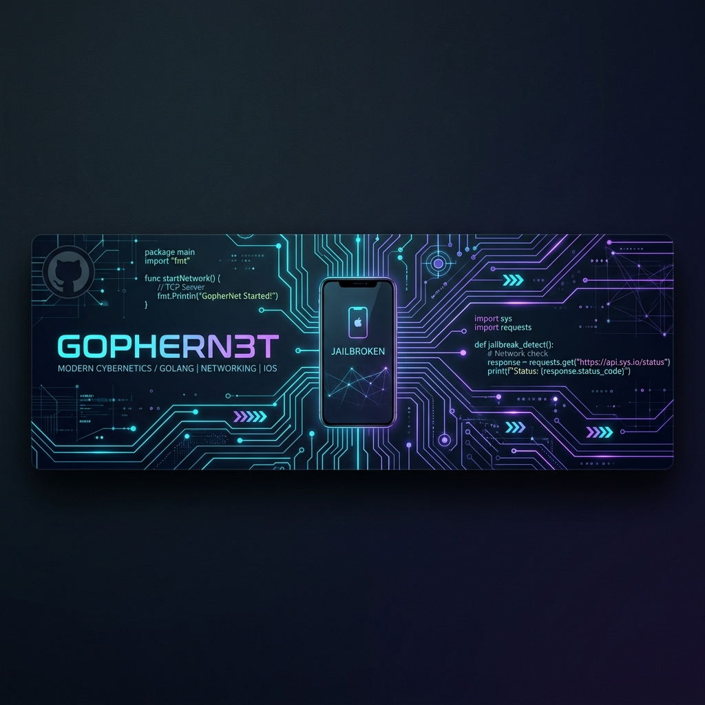

  

  # 👋 Hi, I'm @dabeecao
  ### 🚀 Fullstack Developer | 🐹 Gopher | 🌐 Network Architect | 📱 Legacy iOS Jailbreaker

  

    
  

---

### 📖 About Me

I am a passionate **Fullstack Developer** with a deep love for building robust systems. From crafting high-performance backends in **Golang** to managing complex **Network Infrastructures**, I thrive on solving technical challenges. 

- 🐹 **Golang Enthusiast**: Building scalable services and exploring the Gopher ecosystem.
- 📱 **Jailbreak Legacy**: Experienced in iOS internal tweaks and system-level modifications from the golden era of jailbreaking.
- 🌐 **NetAdmin**: Proficient in network configuration, administration, and security.
- 🛠 **Fullstack**: Versatile in **Python**, **Node.js**, and **PHP** for building end-to-end applications.

---

### 🛠 Tech Stack

| Category | Tools & Languages |
| :--- | :--- |
| **Backend** |     |
| **Frontend** |    |
| **Networking** |    |
| **Tools** |    |

---

### 📊 My GitHub Stats

  
  

  

---

### 🤝 Connect with Me

- 🌍 Check out my work at [github.com/dabeecao](https://github.com/dabeecao)
- 💬 Ask me about **Golang**, **Networking**, or **iOS Tweaks**!

  

